# *Inteligencia artificial en Google Cloud Platform*

Crear un paso a paso explicando como construir dos labs ( el introductorio y uno adicional )

# **Laboratorio Introductorio**

## 1. Acceder a la cuenta de Google

En este lab de nivel introductorio, dará sus primeros pasos con Google Cloud. Para ello, adquirirá experiencia práctica en Cloud Console, una IU integrada en el navegador que le permite acceder a los servicios de Google Cloud y administrarlos. Identificará características clave de Google Cloud y, además, aprenderá los pormenores del entorno de Qwiklabs.

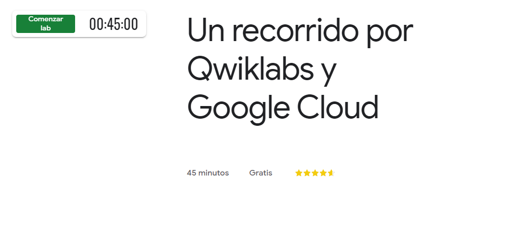

Empezamos el Lab dando click en **Comenzar lab**. Cada laboratorio tiene un costo asi como se muestra en la parte inferior de la imagen anterir este posee un costo **Gratis** por lo que es introductorio.

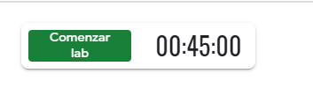

Una vez iniciado, se muestra un temporizador correspondiente a tiempo que nos da la pagina para hacer el laboratorio. Tambien nos muestra un **Nombre de Usuario, Contraseña y un Id del Proyecto** todos correspondientes al laboratorio en curso.

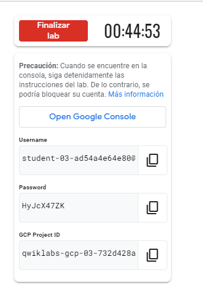

Ingresamos a la consola del proyecto clicando en **Open Google Console**, Este botón abre la consola web y el centro de desarrollo principal de Google Cloud. Realizará la mayor parte del trabajo en Google Cloud desde esta interfaz. Todos los Qwiklabs de Google Cloud usan Cloud Console de alguna forma..

Esta acción abrirá la página de acceso de Google Cloud en una pestaña nueva del navegador.

Copiamos el **Nombre de usuario** del panel **Detalles de la conexión**, y lo pegamos en el campo **Correo electrónico** o teléfono y hacemos clic en **Siguiente**.

    ¡Un momento! Asegúrese de usar el correo electrónico googlexxxxxx_student@qwiklabs.net para acceder, NO su dirección de correo electrónico personal o corporativo.

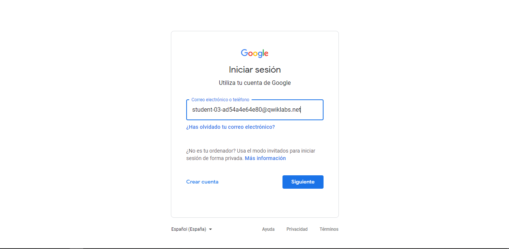

Copiamos la **Contraseña** del panel **Detalles de la conexión**, y la pegamos en el campo **Contraseña** y hacemos clic en **Siguiente**.

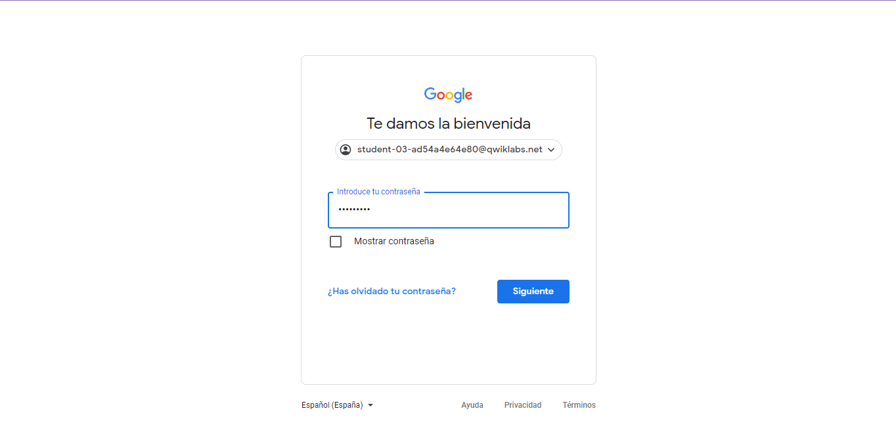

Damos clic en Aceptar para indicar que estamos de acuerdo con las Condiciones del Servicio y la Política de Privacidad de Google.

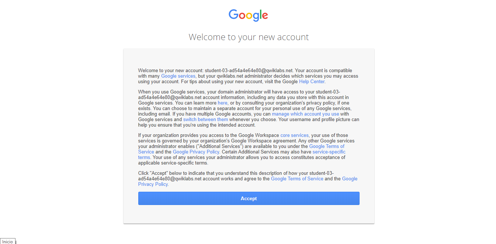

En la página **Welcome student!**, marcamos las **Condiciones del Servicio** para aceptar las **Condiciones del Servicio de Google Cloud** y hacemos clic en **Aceptar y continuar**.

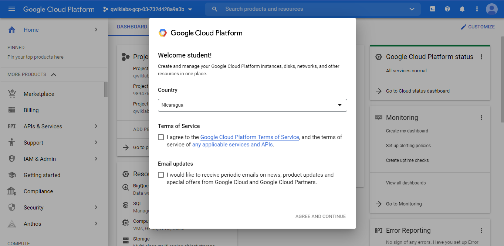

Si se accedimos correctamente la pantalla deberia ser la siguiente:

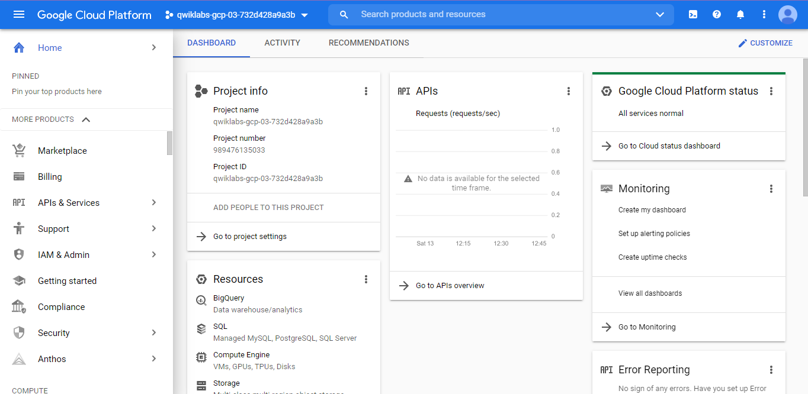

## 2. Proyectos en Cloud Console

La esquina superior izquierda del panel central incluye una tarjeta llamada **Información del proyecto** que se ve de la siguiente manera:

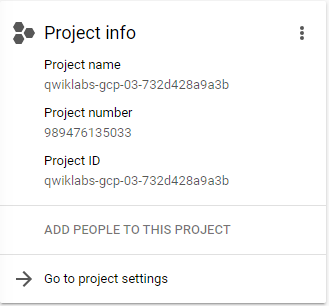

El proyecto tiene un nombre, un ID y un número. Estos identificadores se usan con frecuencia cuando se interactúa con los servicios de Google Cloud.

## Consultar los proyectos

En la barra de títulos de Google Cloud Console, hacemos clic en el menú desplegable que se encuentra junto al nombre de su proyecto.

En el diálogo **Selecciona un proyecto**, damos clic en **Todos**. La lista resultante de proyectos incluye un proyecto llamado **“Qwiklabs Resources”**.

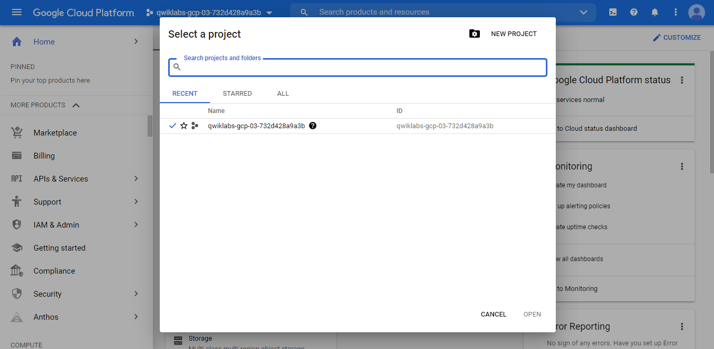

## Menú de navegación y servicios

La barra de títulos de Google Cloud Console también contiene un botón con un ícono de tres líneas:

Si se hace clic en este botón, se abrirá (o se ocultará) el **Menú de navegación**, que proporciona acceso rápido a los servicios principales de Google Cloud.

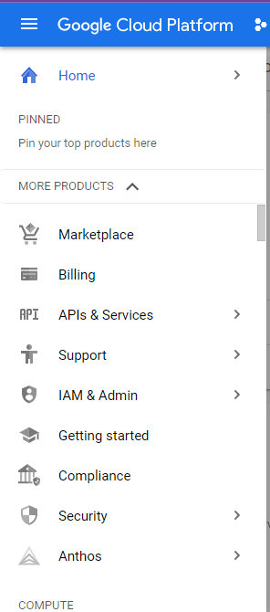

## Visualizar Funciones y permisos

En **Menú de navegación**, hacemosa clic en **IAM y Admin**. Esta acción abrirá una página que contiene una lista de usuarios y especifica los permisos y las funciones otorgados a cuentas específicas.

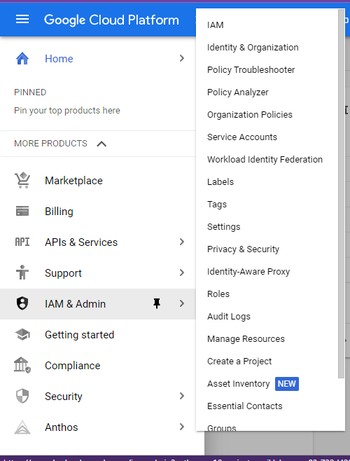

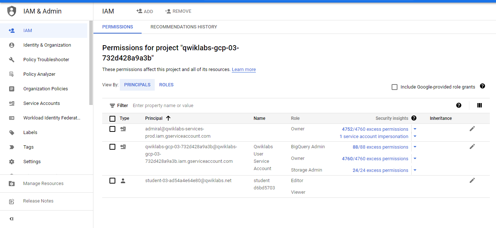

Buscamos el nombre de usuario **"@qwiklabs"** con el que accedimos:

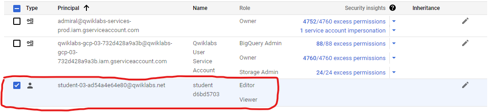

En la columna  **Principal**, se muestra *googlexxxxxx_student@qwiklabs.net* (que coincide con el nombre de usuario con el que accedió). En la columna **Name**, se muestra *googlexxxxxx_student@qwiklabs.net* student. En la columna **Role**, se muestra Editor, que es una de las tres funciones básicas que ofrece **Google Cloud**. Estas funciones establecen permisos a nivel de proyecto y, a menos que se especifique lo contrario, controlan el acceso a todos los servicios de **Google Cloud y su administración**.

## API y servicios

Las API de Google Cloud son una parte clave de Google Cloud. Son interfaces de programación de aplicaciones que puede llamar directamente o través de las bibliotecas cliente. Las API de Cloud usan principios de diseño orientados a los recursos.

### Consultar API disponible

En **Menú de navegación**, hacemos clic en **API & Services > Library**. En el panel izquierdo, debajo del encabezado **Dashboard**, se muestran las diferentes categorías disponibles.

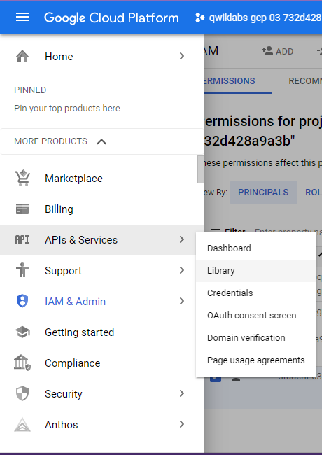

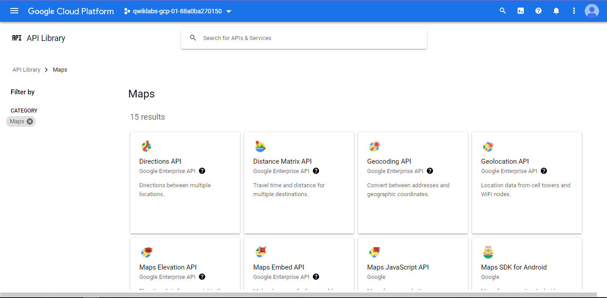

En la barra de búsqueda de API, escribimos **Dialogflow** y, luego, hacemos clic en **Dialogflow API**. Se abrirá la página de descripción de Dialogflow.

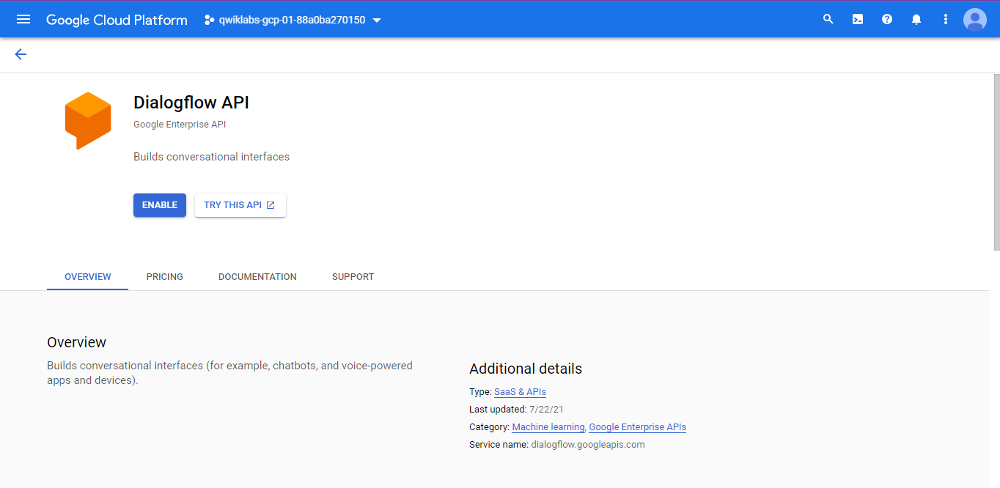

Hacemos clic en **ENABLE**. Se abrirá la página de descripción de Dialogflow.

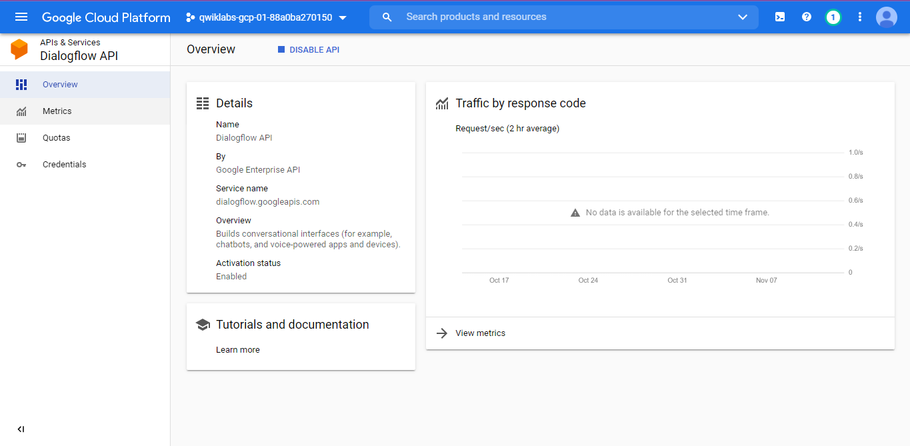

En EL navegador, hacemos clic en el botón **Atrás** para verificar que la API ahora esté habilitada.

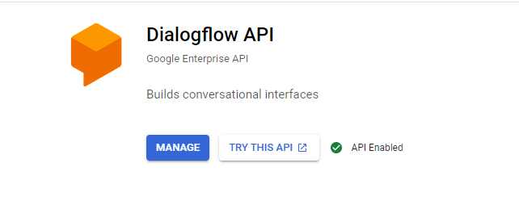

Hacemos clic en **TRY THIS API**. Se abrirá una pestaña nueva en el navegador mostrando la documentación de la **API de Dialogflow**. Exploramos esta información un poco y luego cerramos la pestaña al terminar.

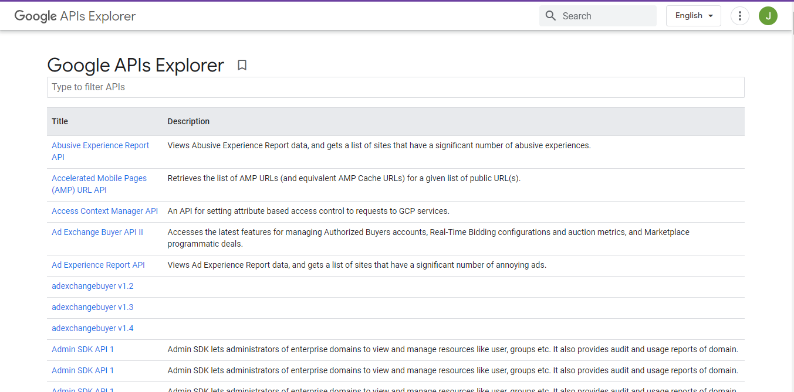

Para regresar a la página principal de **Cloud Console**, en **Menú de navegación**, hacemos clic en **Página principal**.

## Finalizar el lab

Ahora que terminamos el lab, haacemos clic en **Finalizar lab** y, luego, en **Aceptar** para confirmarlo.

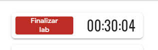

Calificamos el lab con la nota máxima si estamos satisfechos o con una puntuación menor si no lo estaamos. Dejamos comentarios sobre la experiencia en la ventana **“Additional Comments”**. Google aprecia los comentarios considerados.

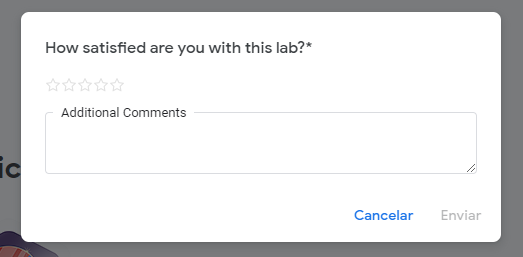